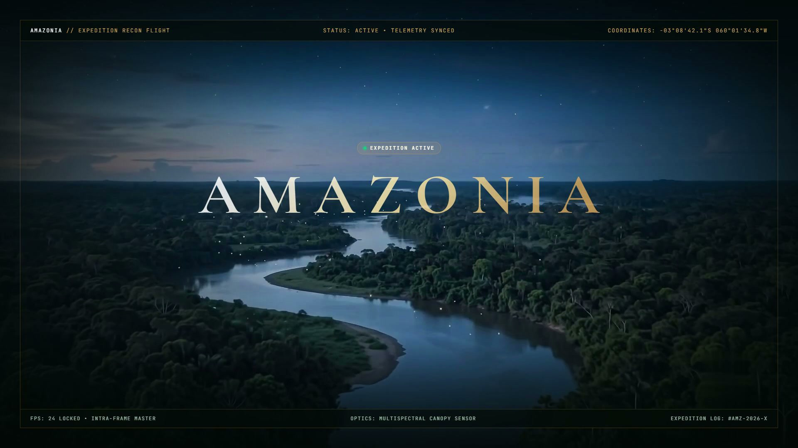

<div align="center">

# 🌿 AMAZONIA — Cinematic Drone Flight Experience

### A scroll-driven cinematic journey through the Amazon rainforest



**[🔗 Live Demo](#) · [📹 Launch Video](brag-output/brag.mp4) · [🐛 Report Bug](https://github.com/pavankumar9d-rgb/Amazon-forest-Drone-Shots/issues)**

</div>

---

## ✨ Overview

**AMAZONIA** is a high-end, scroll-driven cinematic web experience that takes you on a drone expedition over the Amazon rainforest. As you scroll, a 1080p video scrubs frame-by-frame through 8 breathtaking sequences — from sunrise canopy flyovers to bioluminescent firefly reveals — with flight HUD telemetry, expedition data overlays, and museum-grade visual design.

Built as a portfolio showcase piece demonstrating mastery of scroll-synchronized video, buttery-smooth animation, and premium web design.

---

## 🎬 What You'll See

| Sequence | Scene |
|----------|-------|
| 🌅 | **Sunrise Over the Endless Canopy** — Golden hour breaking over the treetops |
| 🏔️ | **Rising Up a Giant Kapok Tree** — Vertical ascent through the canopy layers |
| 🌊 | **The Mighty Amazon River** — Aerial sweep of the world's largest river |
| 🐬 | **The Flooded Forest** — Pink river dolphins gliding through flooded trees |
| 🏘️ | **Indigenous Riverside Community** — Settlements along the waterway |
| 🌿 | **Golden-Hour Oxbow Lake** — Mirror-perfect lake reflections at dusk |
| 💧 | **The Great Waterfall** — Thundering cascades through ancient rock |
| 🌙 | **Night Reveal & Drone Pullback** — Bioluminescent fireflies in the darkness |

---

## 🛠️ Tech Stack

| Layer | Technology |
|-------|-----------|
| **Framework** | [Next.js 15](https://nextjs.org/) (App Router) |
| **Language** | TypeScript |
| **Styling** | CSS with glassmorphism, gradients, and responsive design |
| **Scroll Engine** | [Lenis](https://lenis.darkroom.engineering/) — smooth virtual scroll |
| **Video** | All-Intra H.264 master (every frame is a keyframe for instant bidirectional seeking) |
| **Animation** | Hardware-accelerated lerp with `requestAnimationFrame` |
| **Typography** | Cormorant Garamond × Outfit × JetBrains Mono |
| **Responsive** | Fully adaptive across mobile, tablet, and desktop (`100dvh`) |

---

## 🚀 Getting Started

### Prerequisites

- **Node.js** 18+
- **npm** or **yarn**
- The master video file (see [Video Setup](#-video-setup))

### Installation

```bash
# Clone the repository
git clone https://github.com/pavankumar9d-rgb/Amazon-forest-Drone-Shots.git
cd Amazon-forest-Drone-Shots

# Install dependencies
npm install

# Start the development server
npm run dev
```

Open [http://localhost:3000](http://localhost:3000) in your browser.

### 📹 Video Setup

The master drone footage is too large for GitHub (~188MB). You need to provide it:

1. Place your 1080p drone footage at `public/amazon-80s-master.mp4`
2. For best scrubbing performance, encode as **All-Intra** (every frame is a keyframe):

```bash
ffmpeg -i your_source.mp4 \
  -c:v libx264 -preset slow -crf 18 \
  -g 1 -keyint_min 1 -bf 0 \
  -movflags +faststart \
  -an public/amazon-80s-master.mp4
```

> **Why All-Intra?** Normal H.264 uses inter-frame compression — seeking backwards requires decoding from the nearest keyframe. All-Intra makes every frame independently decodable, giving instant bidirectional scrub with zero stutter.

---

## 📁 Project Structure

```
amazonia/
├── public/
│   ├── amazon-80s-master.mp4   # Master drone footage (not in repo)
│   ├── expedition-seal.png     # Museum-grade expedition medallion
│   └── preview.jpg             # README hero image
├── src/
│   ├── app/
│   │   ├── layout.tsx          # Root layout with fonts & metadata
│   │   ├── page.tsx            # Entry point
│   │   └── globals.css         # Design system & global styles
│   ├── components/
│   │   ├── CinematicScroller.tsx   # Core scroll→video engine
│   │   ├── Navbar.tsx              # Transparent HUD navigation bar
│   │   ├── Preloader.tsx           # Cinematic loading sequence
│   │   ├── ProgressRail.tsx        # Vertical scroll progress indicator
│   │   ├── ExpeditionSeal.tsx      # Interactive expedition medallion
│   │   ├── ExpeditionModal.tsx     # Full-screen expedition data modal
│   │   └── CustomCursor.tsx        # Custom crosshair cursor
│   └── data/
│       └── milestones.ts       # Sequence metadata & coordinates
├── brag-output/                # Launch video assets
│   ├── brag.mp4                # 20s cinematic launch video
│   ├── brag.jpg                # Poster frame / thumbnail
│   └── share-copy.txt          # Social media caption
└── assests/                    # Raw sequence reference frames
```

---

## 🎨 Design Philosophy

- **National Geographic meets Active Theory** — Documentary credibility with interactive web craft
- **Flight HUD Telemetry** — Monospace overlays with coordinates, sector codes, and mission status
- **Glassmorphism** — Frosted-glass panels with `backdrop-filter: blur()` for depth
- **Gold × Forest palette** — `#d4a359` expedition gold against deep canopy greens
- **No placeholders** — Every element is production-grade, including a hand-crafted expedition seal medallion

---

## 📱 Responsive Design

| Device | Adaptation |
|--------|-----------|
| **Desktop** | Full HUD, expanded milestone data, custom cursor |
| **Tablet** | Compact HUD, touch-optimized scroll via Lenis |
| **Mobile** | `100dvh` viewport, minimal medallion token, swipe-friendly |

---

## 🏗️ Key Engineering Decisions

1. **All-Intra Video Encoding** — Eliminates decode lag during reverse scrub. Every frame is independently seekable.
2. **Single-lerp Scroll Engine** — One `requestAnimationFrame` loop drives video seeking. No conflicting secondary lerps or `onSeeked` callbacks.
3. **Lenis Virtual Scroll** — Decouples native scroll from rendering. The scroll position drives the video; the browser never fights the frame.
4. **100dvh for Mobile** — Uses `dvh` units instead of `vh` to account for mobile browser chrome, preventing layout shift on iOS Safari.

---

## 📜 License

This project is for portfolio and educational purposes. The drone footage used is from stock sources — please ensure you have appropriate rights for any footage you use.

---

<div align="center">

**Built with 🌿 by [Pavan Kumar](https://github.com/pavankumar9d-rgb)**

*Step into the living forest.*

</div>
